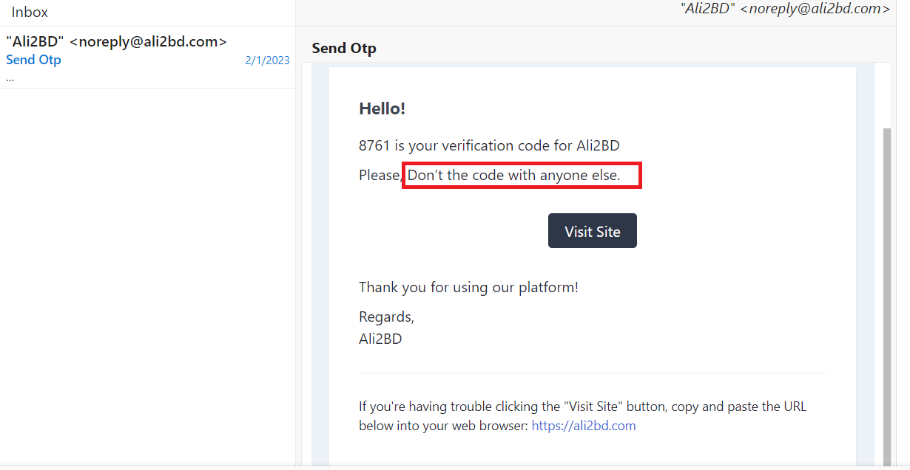
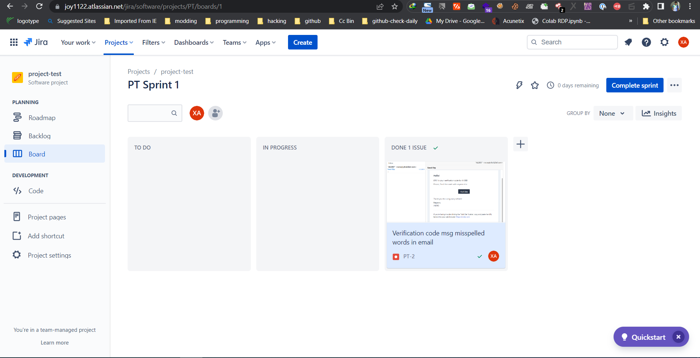

# Bug tracking using jira-ali2bd.com

## Description:
This is simple bug tracking project using jira. Here I used `ali2bd.com` website for tracking a bug using jira. Here shows that how a bug we can assigned to the developer in jira and check time to time how the bug status is changed in jira and at last how the bug got fixed.

<H3 align="center">Ali2bd.com</H3>

**Description:**
1. Navigate to the url https://ali2bd.com/ 

2. Click on sign up/sign in options

3. Fill up the Mobile no./Email field with valid data

4. Click on continue

5. Now you should received a verification code to your email which words is misspelled.

**The work was assigned to xcoder ahmed(developer) for solving the issue.**

**The developer is working and it was in progress is started.**

**Developer completed the work and the issue is resolved.**

